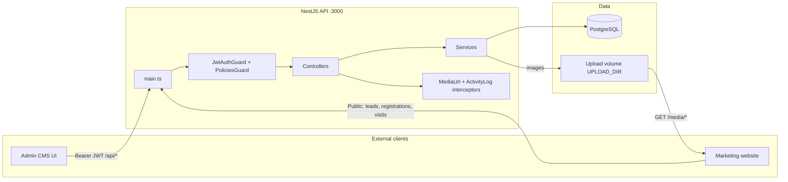

# Journey Project — Data Flow

Backend-only Admin CMS API (NestJS + Prisma + PostgreSQL). External admin panel and marketing site are the consumers.

| Layer | Technology |
|---|---|
| API framework | NestJS 10 (Express) |
| ORM | Prisma 5 → PostgreSQL |
| Auth | JWT + CASL (`admin` / `editor` / `viewer`) |
| Docs | Swagger at `/api/docs` |

Public capture endpoints feed leads, event registrations, and site visits. Media is WebP on disk; metadata lives in Postgres. See also [`prisma/ERD.md`](../prisma/ERD.md).

---

## Architecture



### Authenticated request pipeline

1. `ValidationPipe` (whitelist / transform)
2. Global `JwtAuthGuard` (skipped if `@Public()`)
3. Per-route `PoliciesGuard` + `@CheckPolicies(...)` (CASL)
4. Controller → Service → `PrismaService`
5. `MediaUrlInterceptor` (`storageKey` → public `url`)
6. On mutating methods, `ActivityLogInterceptor` writes `activity_logs`

### Entry points

| Kind | Path |
|---|---|
| Process entry | `src/main.ts` |
| App root module | `src/app.module.ts` |
| API base | `/api` (`API_PREFIX`) |
| Swagger | `/api/docs` |
| Media files | `/media/*` (excluded from API prefix) |

---

## Auth / session flow

```mermaid
sequenceDiagram
  participant C as Client
  participant Auth as AuthController/Service
  participant DB as PostgreSQL

  C->>Auth: POST /api/auth/login {email, password}
  Auth->>DB: find user, bcrypt.compare
  Auth->>DB: update lastLoginAt
  Auth->>DB: create refresh_tokens (SHA-256 hash)
  Auth-->>C: { accessToken, refreshToken, user }

  C->>Auth: API call Authorization: Bearer accessToken
  Note over Auth: JwtStrategy → request.user {id,email,role}
  Note over Auth: PoliciesGuard builds CASL ability from role

  C->>Auth: POST /api/auth/refresh {refreshToken}
  Auth->>DB: verify JWT + hash lookup; revoke old; issue new pair
  Auth-->>C: { accessToken, refreshToken }

  C->>Auth: POST /api/auth/logout {refreshToken}
  Auth->>DB: set revokedAt
```

**Token lifecycle:** Access TTL default **15m** · Refresh **7d** (hashed, rotated on refresh).

| Role | Capability |
|---|---|
| `admin` | `manage all` |
| `editor` | Full content CRUD/publish; cannot manage users/settings/social; can update own user |
| `viewer` | Read-all; update own user |

**Key files:** `src/auth/auth.controller.ts`, `src/auth/auth.service.ts`, `src/auth/strategies/jwt.strategy.ts`, `src/auth/casl/`

---

## Journey walkthroughs

### A. Admin login → dashboard

**Auth:** Public login, then Bearer JWT

1. `POST /api/auth/login` with email + password
2. `AuthService` validates user via bcrypt against `users`
3. Issue access + refresh tokens; store refresh hash in `refresh_tokens`
4. Client calls `GET /api/dashboard/summary` with Bearer token
5. `DashboardService` aggregates leads, articles, destinations, `siteVisits`, `activity_logs`

**Endpoints:** `POST /api/auth/login`, `POST /api/auth/refresh`, `GET /api/dashboard/summary`

**Files:** `src/auth/`, `src/dashboard/dashboard.service.ts`

---

### B. Content CRUD (banners, staff, destinations, …)

**Auth:** JWT + CASL subject check

1. Authenticated request hits controller with `@CheckPolicies`
2. Service uses `BasePrismaService` or custom Prisma calls
3. DTOs pass media FK ids (not file blobs)
4. Prisma write/read with `include` for related `media_assets`
5. `MediaUrlInterceptor` adds public `url`; mutating calls write `activity_logs`

**Endpoints:** `GET|POST|PATCH|DELETE /api/banners`, `/api/articles`, and the same pattern for staff, destinations, visa, etc.

**Files:** `src/common/crud/base-prisma.service.ts`, `src/banners/`, `src/articles/`, `src/common/interceptors/media-url.interceptor.ts`

---

### C. Media upload → attach to content

**Auth:** JWT + `Action.Create` on Media

1. `POST /api/media-assets` multipart field `file`
2. Validate mime → sharp → WebP → `$UPLOAD_DIR/yyyy/mm/dd/{uuid}.webp`
3. Insert `media_assets` row (`storageKey`, dimensions, checksum)
4. Client stores returned `id` as `featuredImageId` / `coverImageId` on content
5. Nightly `MediaGarbageCollector` deletes orphans older than 24h

**Endpoints:** `POST /api/media-assets`, `GET /media/{storageKey}`

**Files:** `src/media/media.controller.ts`, `src/media/media.service.ts`, `src/media/media.gc.ts`

---

### D. Public lead capture

**Auth:** `@Public()` — no JWT

1. Marketing site `POST /api/leads/submit`
2. `LeadsService.create` → `leads` row (`status: new`, topic enum)
3. Admins later list/update via authenticated `/api/leads`

**Endpoints:** `POST /api/leads/submit`, `GET|PATCH /api/leads`

**Files:** `src/leads/leads.controller.ts`, `src/leads/leads.service.ts`

---

### E. Public event registration

**Auth:** Admin JWT for setup; public for register

1. Admin creates event + nested `formFields`
2. Site `POST /api/events/:id/registrations`
3. Check form enabled + max capacity
4. Insert `event_registrations` with `answers` JSON
5. Admin lists via `GET /api/events/:id/registrations`

**Endpoints:** `POST /api/events`, `POST /api/events/:id/registrations`, `GET /api/events/:id/registrations`

**Files:** `src/events/events.controller.ts`, `src/events/events.service.ts`

---

### F. Site visit counter

**Auth:** `@Public()`

1. Site `POST /api/analytics/visit`
2. `SettingsService.incrementSiteVisits` on singleton `site_settings`
3. Dashboard summary reads `siteVisits`

**Endpoints:** `POST /api/analytics/visit`, `GET /api/dashboard/summary`

**Files:** `src/settings/analytics.controller.ts`, `src/settings/settings.service.ts`

---

## Module → route map

| Module | Base route | Notes |
|---|---|---|
| Auth | `/api/auth` | login, refresh, logout, me |
| Users | `/api/users` | admin CRUD + self profile |
| Media | `/api/media-assets` | files at `/media` |
| Dashboard | `/api/dashboard/summary` | aggregates |
| Activity logs | `/api/activity-logs` | audit feed |
| Banners | `/api/banners` | homepage |
| About Us | `/api/about-us` | singleton + highlights |
| Staff | `/api/staff` | team members |
| Destinations | `/api/destinations` | PublishStatus |
| Articles | `/api/articles` | + `/article-categories` |
| Visa | `/api/visa-services` | + documents |
| Testimonials | `/api/testimonials` | counselor FK |
| Videos | `/api/videos` | + page-settings |
| Events | `/api/events` | + public registrations |
| Leads | `/api/leads` | + public `/submit` |
| Settings | `/api/settings` | + social-links |
| Analytics | `/api/analytics/visit` | public counter |

---

## Entity hub (`media_assets`)

All image FKs point to `media_assets` (`ON DELETE SET NULL`). Files live on disk only.

| Entity | Role | Key relations |
|---|---|---|
| `users` | CMS accounts | avatar, refresh_tokens, activity_logs, articles |
| `refresh_tokens` | Session rotate/revoke | → user (cascade) |
| `activity_logs` | Audit feed | → user (set null) |
| `media_assets` | Image metadata | referenced by most content |
| `banners` | Homepage | → image |
| `about_us` | Singleton bio | highlights, team header image |
| `staff_members` | Team | photo; testimonials as counselor |
| `destinations` | Study destinations | cover; PublishStatus |
| `articles` | Blog | category, author, featured image |
| `visa_services` | Visa pages | cascade `visa_documents` |
| `testimonials` | Reviews | counselor, portrait |
| `videos` | Video page | YouTube + thumbnail |
| `events` | Events + RSVP | form_fields, registrations |
| `leads` | Inquiries | topic/status; `lead_code` |
| `site_settings` | Contact/SEO/visits | logo + contact cover |
| `social_links` | Footer/social | platform enum |

---

## Key environment variables

| Variable | Purpose |
|---|---|
| `DATABASE_URL` | Postgres for Prisma |
| `JWT_ACCESS_SECRET` / `JWT_ACCESS_TTL` | Access token |
| `JWT_REFRESH_SECRET` / `JWT_REFRESH_TTL` | Refresh token |
| `UPLOAD_DIR` | Disk path for images |
| `PUBLIC_MEDIA_URL` | Public media base URL |
| `MAX_UPLOAD_MB` | Upload size limit |
| `SEED_ADMIN_*` | Bootstrap admin via seed |
| `PORT` / `API_PREFIX` | Runtime (`3000` / `api`) |

See [`.env.example`](../.env.example).

---

## Related docs

| Doc | Contents |
|---|---|
| [`README.md`](../README.md) | Stack, setup, modules |
| [`prisma/ERD.md`](../prisma/ERD.md) | Mermaid ERD + enums |
| [`prisma/FULL_ERD.md`](../prisma/FULL_ERD.md) | Compact ER diagram |
| [`src/auth/casl/README.md`](../src/auth/casl/README.md) | Role matrix |
| Swagger `/api/docs` | Live OpenAPI |
