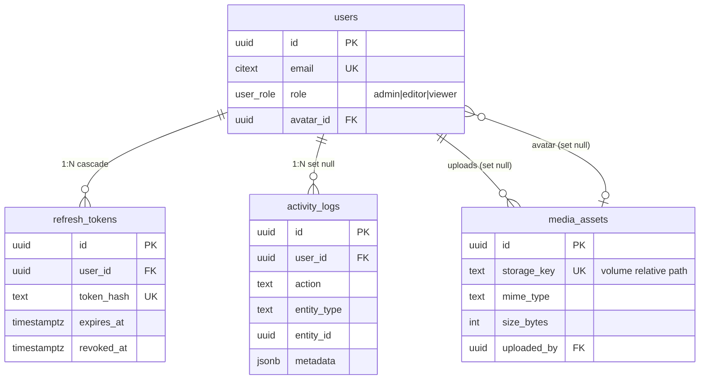

# Journey Education Admin CMS — ER Diagram

Source of truth: [`schema.prisma`](./schema.prisma)  
Conventions: UUID PKs · bilingual `*_en` / `*_th` · image FKs → `media_assets` (`ON DELETE SET NULL`) · no BLOBs

---

## 1. Overview (relationships)

```mermaid
erDiagram
    users ||--o{ refresh_tokens : has
    users ||--o{ activity_logs : performs
    users ||--o{ media_assets : uploads
    users ||--o{ articles : authors
    users }o--o| media_assets : avatar

    media_assets ||--o{ banners : image
    media_assets ||--o{ staff_members : photo
    media_assets ||--o{ destinations : cover
    media_assets ||--o{ articles : featured
    media_assets ||--o{ about_us : team_header
    media_assets ||--o{ visa_services : header
    media_assets ||--o{ testimonials : portrait
    media_assets ||--o{ videos : thumbnail
    media_assets ||--o{ video_page_settings : header
    media_assets ||--o{ events : cover
    media_assets ||--o{ site_settings : "contact_cover / logo"

    about_us ||--o{ about_highlights : contains
    staff_members ||--o{ testimonials : counselor
    article_categories ||--o{ articles : classifies
    visa_services ||--o{ visa_documents : checklist
    events ||--o{ event_form_fields : defines
    events ||--o{ event_registrations : receives

    users {
        uuid id PK
        text name
        text email UK
        text password_hash
        user_role role
        uuid avatar_id FK
        boolean is_active
        timestamptz last_login_at
    }

    media_assets {
        uuid id PK
        text storage_key UK
        text mime_type
        int size_bytes
        int width
        int height
        char checksum_sha256
        uuid uploaded_by FK
    }

    banners {
        uuid id PK
        text name
        text link_url
        uuid image_id FK
        boolean is_active
        int sort_order
    }

    about_us {
        uuid id PK
        text company_title_en
        text company_title_th
        text bio_en
        text bio_th
        uuid team_header_image_id FK
        boolean is_singleton UK
    }

    about_highlights {
        uuid id PK
        uuid about_us_id FK
        text title_en
        text title_th
        text description_en
        text description_th
        boolean is_enabled
    }

    staff_members {
        uuid id PK
        text full_name_en
        text full_name_th
        uuid photo_id FK
        staff_status status
        boolean is_visible
    }

    destinations {
        uuid id PK
        text name_en
        text name_th
        uuid cover_image_id FK
        publish_status status
    }

    article_categories {
        uuid id PK
        text name_en
        text slug UK
        text color
    }

    articles {
        uuid id PK
        text title_en
        text slug UK
        uuid category_id FK
        uuid author_id FK
        uuid featured_image_id FK
        publish_status status
    }

    visa_services {
        uuid id PK
        text title
        text country
        uuid header_image_id FK
        simple_status status
    }

    visa_documents {
        uuid id PK
        uuid visa_service_id FK
        text label
    }

    testimonials {
        uuid id PK
        text student_name_en
        uuid counselor_id FK
        uuid portrait_image_id FK
        review_status status
        smallint rating
    }

    video_page_settings {
        uuid id PK
        text page_title_en
        text page_title_th
        uuid header_image_id FK
        boolean is_singleton UK
    }

    videos {
        uuid id PK
        text youtube_url
        uuid thumbnail_id FK
        publish_status status
    }

    events {
        uuid id PK
        text name_en
        event_format format
        uuid cover_image_id FK
        event_status status
    }

    event_form_fields {
        uuid id PK
        uuid event_id FK
        text label_en
        form_field_type field_type
    }

    event_registrations {
        uuid id PK
        uuid event_id FK
        text first_name
        text email
        jsonb answers
    }

    leads {
        uuid id PK
        text lead_code UK
        text full_name
        lead_topic topic
        lead_status status
    }

    site_settings {
        uuid id PK
        uuid logo_id FK
        uuid contact_cover_image_id FK
        int site_visits
        boolean is_singleton UK
    }

    social_links {
        uuid id PK
        social_platform platform
        text url
        boolean is_active
    }

    refresh_tokens {
        uuid id PK
        uuid user_id FK
        text token_hash UK
        timestamptz expires_at
    }

    activity_logs {
        uuid id PK
        uuid user_id FK
        text action
        text entity_type
        text summary
    }
```



---

## 2. Auth & media hub



---

## 3. Content modules

```mermaid
erDiagram
    about_us ||--o{ about_highlights : "1:N cascade (max 3 app)"
    article_categories ||--o{ articles : "1:N set null"
    users ||--o{ articles : authors
    staff_members ||--o{ testimonials : counselor
    visa_services ||--o{ visa_documents : "1:N cascade"
    events ||--o{ event_form_fields : "1:N cascade"
    events ||--o{ event_registrations : "1:N cascade"

    about_us {
        boolean is_singleton UK
        text company_title_en
        text company_title_th
    }

    about_highlights {
        text title_en
        text title_th
        text description_en
        text description_th
    }

    articles {
        text title_en
        text title_th
        text slug UK
        publish_status status
    }

    destinations {
        text name_en
        text name_th
        publish_status status
    }

    banners {
        text name
        boolean is_active
        int sort_order
    }

    staff_members {
        text full_name_en
        staff_status status
        boolean is_visible
    }

    testimonials {
        text student_name_en
        smallint rating "1-5"
        review_status status
    }

    videos {
        text youtube_url
        publish_status status
    }

    video_page_settings {
        boolean is_singleton UK
        text page_title_en
        text page_title_th
    }

    visa_services {
        text title
        text country
        simple_status status
    }

    events {
        text name_en
        event_format format
        event_status status
    }

    leads {
        text lead_code UK
        lead_topic topic
        lead_status status
    }

    site_settings {
        boolean is_singleton UK
        int site_visits
    }

    social_links {
        social_platform platform
        text url
    }
```



---

## 4. Enums

| Enum | Values |
|---|---|
| `UserRole` | admin, editor, viewer |
| `PublishStatus` | draft, pending, published, archived |
| `StaffStatus` | active, on_leave, inactive |
| `SimpleStatus` | active, inactive |
| `ReviewStatus` | pending, published, hidden |
| `EventFormat` | online, offline |
| `EventStatus` | draft, scheduled, active, completed, cancelled |
| `LeadStatus` | new, contacted, qualified, converted, closed |
| `LeadTopic` | international_undergraduate, postgraduate_programs, scholarship_inquiry, visa_assistance, other |
| `SocialPlatform` | facebook, instagram, line, youtube, tiktok, twitter, linkedin, other |
| `FormFieldType` | text, email, phone, select, textarea, date, number, checkbox |

---

## 5. Singletons

| Table | Constraint |
|---|---|
| `about_us` | `UNIQUE (is_singleton)` |
| `video_page_settings` | `UNIQUE (is_singleton)` |
| `site_settings` | `UNIQUE (is_singleton)` |

---

Preview in VS Code / GitHub / [mermaid.live](https://mermaid.live) by pasting any ` ```mermaid ` block above.
